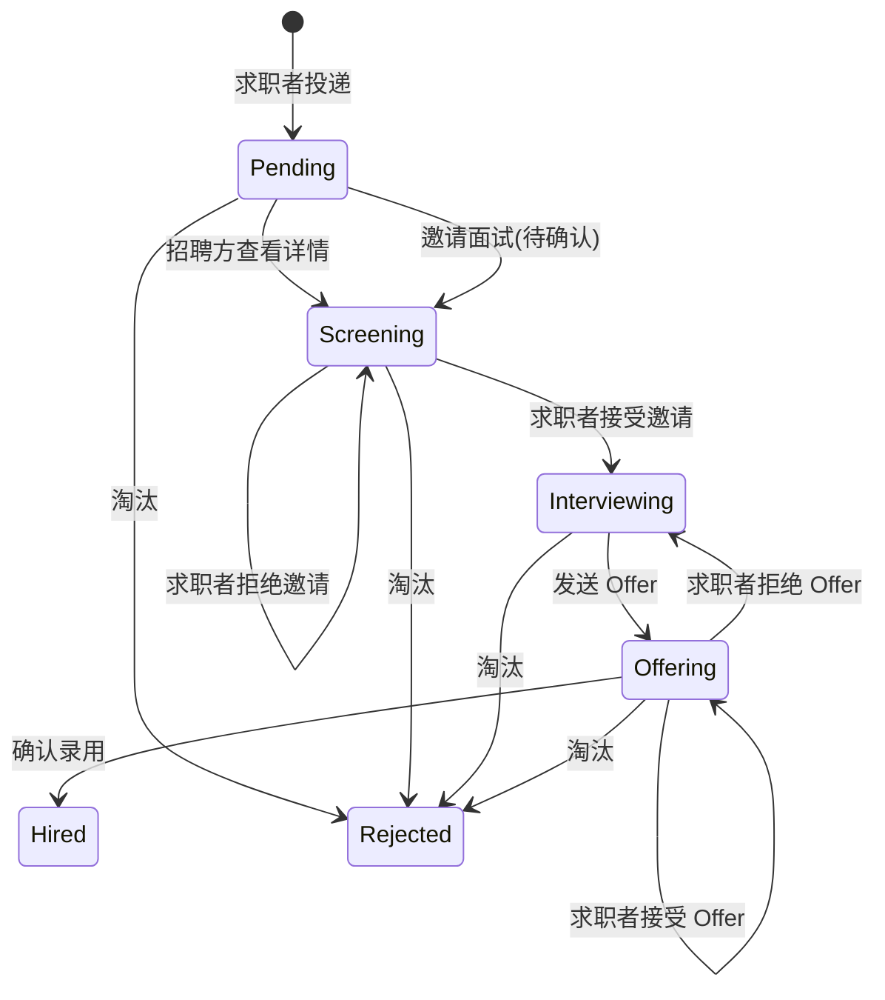

# 投递

## 说明

- 路由前缀：`/rc`
- 鉴权：均需 `Bearer Token`，并使用 `auth:rc`
- 适用对象：
  - **求职者**（`identity_type = 1`）：投递、查看自己的记录、撤回、处理面试邀请、接受 / 拒绝 Offer
  - **招聘方**（`identity_type = 2`，已绑定企业）：查看本企业收到的投递、邀请面试、发 Offer、录用、淘汰
- 成功响应：`api_response()`，结构为 `code` + `data` + `meta`
- 业务错误：`error()`，结构为 `code` + `message` + `meta`

> 投递是求职者与招聘方共用的业务资源，因此统一挂在 `/rc/applications`，而非 `/rc/talent/*`。相关站内通知见 [通知.md](./通知.md)。

### 响应 `meta` 结构（成功 / 业务错误）

| 字段 | 类型 | 说明 |
|------|------|------|
| `timestamp` | float | 服务端时间戳 |
| `response_time` | float | 请求耗时（秒） |

### 列表公共规则

- 分页结构与 Laravel 标准分页一致：`data`、`total`、`per_page`、`current_page`、`last_page` 等
- Query 参数 `per_page`：默认 15，最大 100

---

## 公共数据结构

### 投递对象（`RcApplicationResource`）

| 字段 | 类型 | 说明 |
|------|------|------|
| `id` | int | 投递 ID |
| `company_id` | int | 企业 ID |
| `job_id` | int | 职位 ID |
| `resume_id` | int | 简历 ID |
| `candidate_user_id` | int | 候选人用户 ID |
| `current_stage_id` | int\|null | 当前招聘阶段 |
| `source_type` | int | 来源类型，见 [RcApplicationSourceType](#rcapplicationsourcetype) |
| `source_type_label` | string\|null | 来源类型中文 |
| `status` | int | 投递状态，见 [RcApplicationStatus](#rcapplicationstatus) |
| `status_label` | string\|null | 投递状态中文 |
| `applied_at` | string\|null | 投递时间 |
| `withdrawn_at` | string\|null | 撤回时间 |
| `created_at` | string\|null | 创建时间 |
| `updated_at` | string\|null | 更新时间 |
| `job` | object\|null | 关联职位（`RcJobResource`） |
| `company` | object\|null | 企业摘要 `{ id, name }` |
| `resume` | object\|null | 求职者视角返回本人实时简历（`RcApplicationResumeResource`） |
| `candidate` | object\|null | 招聘方视角返回候选人摘要（脱敏，无联系方式） |
| `resume_snapshot` | object\|null | 招聘方**详情**返回投递时完整简历快照，见 [投递简历快照](#投递简历快照) |
| `pending_interview_invitation` | object\|null | 待候选人确认的面试邀请，见 [待确认面试邀请](#待确认面试邀请-pending_interview_invitation) |
| `offer` | object\|null | 当前有效 Offer（已发送 / 已接受），见 [Offer 信息](#offer-信息-offer) |

### Offer 信息（`offer`）

投递存在状态为 `已发送` 或 `已接受` 的 Offer 时返回（列表与详情均可能携带）。

| 字段 | 类型 | 说明 |
|------|------|------|
| `id` | int | Offer ID |
| `offer_no` | string | Offer 编号 |
| `salary` | string\|null | 确认薪资 |
| `salary_unit` | int\|null | 薪资单位 |
| `salary_unit_label` | string\|null | 薪资单位中文 |
| `has_probation` | bool | 是否有试用期 |
| `remuneration_note` | string\|null | 薪酬说明 |
| `attendance_note` | string\|null | 考勤说明 |
| `entry_date` | string\|null | 入职日期 |
| `expire_date` | string\|null | Offer 过期日期 |
| `status` | int | Offer 状态 |
| `status_label` | string\|null | Offer 状态中文 |
| `sent_at` | string\|null | 发送时间 |
| `replied_at` | string\|null | 回复时间 |
| `note` | string\|null | 备注 |
| `extra` | object\|null | 扩展信息（试用期详情等） |
| `email_sent_at` | string\|null | 邮件发送时间 |
| `sms_sent_at` | string\|null | 短信发送时间 |

```json
{
  "id": 7,
  "offer_no": "OFFER-1-000018-20260612110000",
  "salary": "18000.00",
  "salary_unit": 1,
  "salary_unit_label": "月",
  "has_probation": true,
  "remuneration_note": "五险一金，年终奖按公司制度",
  "attendance_note": "周一至周五 9:00-18:00",
  "entry_date": "2026-07-01",
  "expire_date": "2026-06-20",
  "status": 1,
  "status_label": "已发送",
  "sent_at": "2026-06-12T11:00:00.000000Z",
  "replied_at": null,
  "note": "含五险一金",
  "extra": {
    "probation_months": 3,
    "probation_salary": "15000.00"
  },
  "email_sent_at": null,
  "sms_sent_at": null
}
```

### 待确认面试邀请（`pending_interview_invitation`）

存在状态为 `待候选人确认`（`AwaitingCandidate = 4`）的面试记录时返回，列表与详情均可能携带。

| 字段 | 类型 | 说明 |
|------|------|------|
| `id` | int | 面试记录 ID |
| `interview_at` | string\|null | 面试时间 |
| `duration_mins` | int\|null | 面试时长（分钟） |
| `mode` | int\|null | 面试方式：`1` 线上、`2` 线下、`3` 电话 |
| `mode_label` | string\|null | 面试方式中文 |
| `interviewer_name` | string\|null | 面试官姓名 |
| `location` | string\|null | 面试地点 |
| `meeting_url` | string\|null | 线上会议链接 |
| `note` | string\|null | 备注 |
| `status` | int\|null | 面试状态，待确认时为 `4` |
| `status_label` | string\|null | 面试状态中文 |

```json
{
  "id": 5,
  "interview_at": "2026-06-13T14:00:00.000000Z",
  "duration_mins": 60,
  "mode": 2,
  "mode_label": "线下",
  "interviewer_name": "张经理",
  "location": "南昌高新区创业大厦 A 座",
  "meeting_url": null,
  "note": "请携带身份证原件",
  "status": 4,
  "status_label": "待候选人确认"
}
```

### 投递简历快照（`resume` / `resume_snapshot`）

求职者详情返回实时 `resume`；招聘方详情返回投递时 `resume_snapshot`。两者结构一致，均包含：

| 区块 | 说明 |
|------|------|
| 基本信息 | `RcResumeResource` 全部字段（姓名、联系方式、学历、居住城市等） |
| `works` | 工作经历列表（`RcResumeWorkResource`） |
| `educations` | 教育经历列表（`RcResumeEducationResource`） |
| `languages` | 语言能力列表（`RcResumeLanguageResource`） |
| `skills` | 专业技能列表（`RcResumeSkillResource`） |

快照在投递时写入，后续候选人修改简历不会影响已投递记录。招聘方详情中的 `phone`、`email` 仅返回脱敏值（如 `138****8000`、`can******@example.com`），不暴露真实联系方式。

### 候选人摘要（`candidate`，招聘方视角）

| 字段 | 类型 | 说明 |
|------|------|------|
| `full_name` | string\|null | 姓名 |
| `age` | int\|null | 年龄 |
| `work_years` | int\|null | 工作年限 |
| `highest_education_level` | int\|null | 最高学历 |
| `current_residence_city` | string\|null | 现居住城市全称 |
| `current_city_code` | string\|null | 现居住城市编码 |

### 视角差异

| 视角 | 列表 | 详情 |
|------|------|------|
| 求职者 | `job` + `company` + `resume` | `job` + `company` + `resume`（实时简历，不含 `resume_snapshot`） |
| 招聘方 | `job` + `company` + `candidate`（无联系方式） | `job` + `company` + `candidate` + `resume_snapshot`（联系方式脱敏） |

> `resume_snapshot` 仅在详情接口（`show`）返回，列表不返回，避免批量暴露联系方式。存在待确认面试邀请时返回 `pending_interview_invitation`；存在有效 Offer 时返回 `offer`。

---

## 1) 投递列表

- 接口：`GET /rc/applications`
- 描述：求职者查看自己的投递；招聘方查看本企业收到的投递

### Query 参数

| 字段 | 是否必填 | 说明 |
|------|----------|------|
| `job_id` | 否 | 招聘方按职位筛选 |
| `status` | 否 | 按投递状态筛选 |
| `per_page` | 否 | 每页条数，默认 15，最大 100 |

### 请求示例（求职者）

```http
GET /rc/applications?per_page=15
Authorization: Bearer {token}
```

### 请求示例（招聘方）

```http
GET /rc/applications?job_id=12&status=1&per_page=15
Authorization: Bearer {token}
```

### 成功响应示例（求职者）

```json
{
  "code": 200,
  "data": {
    "current_page": 1,
    "data": [
      {
        "id": 18,
        "company_id": 1,
        "job_id": 12,
        "resume_id": 3,
        "candidate_user_id": 42,
        "current_stage_id": 2,
        "source_type": 1,
        "source_type_label": "主动投递",
        "status": 1,
        "status_label": "筛选中",
        "applied_at": "2026-06-11T10:00:00.000000Z",
        "withdrawn_at": null,
        "created_at": "2026-06-11T10:00:00.000000Z",
        "updated_at": "2026-06-12T10:30:00.000000Z",
        "job": {
          "id": 12,
          "title": "Laravel 工程师",
          "company": { "id": 1, "name": "南昌示例科技有限公司" }
        },
        "company": {
          "id": 1,
          "name": "南昌示例科技有限公司"
        },
        "resume": {
          "id": 3,
          "full_name": "求职者甲",
          "phone": "13800138000",
          "email": "seeker@example.com"
        },
        "pending_interview_invitation": {
          "id": 5,
          "interview_at": "2026-06-13T14:00:00.000000Z",
          "duration_mins": 60,
          "mode": 2,
          "mode_label": "线下",
          "interviewer_name": "张经理",
          "location": "南昌高新区创业大厦 A 座",
          "meeting_url": null,
          "note": "请携带身份证原件",
          "status": 4,
          "status_label": "待候选人确认"
        }
      }
    ],
    "first_page_url": "http://example.com/rc/applications?page=1",
    "from": 1,
    "last_page": 1,
    "last_page_url": "http://example.com/rc/applications?page=1",
    "links": [],
    "next_page_url": null,
    "path": "http://example.com/rc/applications",
    "per_page": 15,
    "prev_page_url": null,
    "to": 1,
    "total": 1
  },
  "meta": {
    "timestamp": 1749732600.123456,
    "response_time": 0.052
  }
}
```

### 成功响应示例（招聘方）

```json
{
  "code": 200,
  "data": {
    "current_page": 1,
    "data": [
      {
        "id": 18,
        "company_id": 1,
        "job_id": 12,
        "resume_id": 3,
        "candidate_user_id": 42,
        "current_stage_id": 2,
        "source_type": 1,
        "source_type_label": "主动投递",
        "status": 1,
        "status_label": "筛选中",
        "applied_at": "2026-06-11T10:00:00.000000Z",
        "withdrawn_at": null,
        "created_at": "2026-06-11T10:00:00.000000Z",
        "updated_at": "2026-06-12T10:30:00.000000Z",
        "job": {
          "id": 12,
          "title": "Laravel 工程师"
        },
        "company": {
          "id": 1,
          "name": "南昌示例科技有限公司"
        },
        "candidate": {
          "full_name": "候选人甲",
          "age": 28,
          "work_years": 5,
          "highest_education_level": 4,
          "current_residence_city": "中国江西省南昌市",
          "current_city_code": "360100"
        },
        "pending_interview_invitation": {
          "id": 5,
          "interview_at": "2026-06-13T14:00:00.000000Z",
          "duration_mins": 60,
          "mode": 2,
          "mode_label": "线下",
          "interviewer_name": "张经理",
          "location": "南昌高新区创业大厦 A 座",
          "meeting_url": null,
          "note": "请携带身份证原件",
          "status": 4,
          "status_label": "待候选人确认"
        }
      }
    ],
    "total": 1,
    "per_page": 15,
    "current_page": 1
  },
  "meta": {
    "timestamp": 1749732600.123456,
    "response_time": 0.048
  }
}
```

### 业务失败示例

```json
{
  "code": 422,
  "message": "请先切换为求职者或招聘方身份。",
  "meta": {
    "timestamp": 1749732600.123456,
    "response_time": 0.01
  }
}
```

---

## 2) 查询指定职位投递记录

- 接口：`GET /rc/applications/check`
- 描述：根据职位与求职者用户 / 简历查询是否已存在投递记录
- 鉴权：需 `Bearer Token` + 当前身份为求职者或招聘方

### Query 参数

| 字段 | 是否必填 | 说明 |
|------|----------|------|
| `job_id` | 是 | 职位 ID，必须是未删除职位 |
| `candidate_user_id` | 否 | 求职者用户 ID；与 `resume_id` 至少传一个 |
| `resume_id` | 否 | 简历 ID；与 `candidate_user_id` 至少传一个 |

### 请求示例（按求职者查询）

```http
GET /rc/applications/check?job_id=12&candidate_user_id=42
Authorization: Bearer {token}
```

### 请求示例（按简历查询）

```http
GET /rc/applications/check?job_id=12&resume_id=3
Authorization: Bearer {token}
```

### 身份与数据范围

| 当前身份 | 查询范围 | 说明 |
|----------|----------|------|
| 求职者 | 当前用户自己的投递 | 即使传入其他 `candidate_user_id`，也返回 `data: null` |
| 招聘方（已绑定企业） | 当前企业名下职位的投递 | 若职位不属于当前企业，返回 `data: null` |

### 返回规则

- 找到投递记录：`data` 返回 `RcApplicationResource` 投递对象
- 未找到投递记录：`data` 返回 `null`
- 职位不存在：由于 `job_id` 使用存在性校验，返回参数校验错误
- 非求职者或招聘方身份：返回业务错误 `422`

> 若同时传入 `candidate_user_id` 与 `resume_id`，查询条件会同时生效；接口按 `id` 倒序返回最新一条匹配投递记录。

### 成功响应示例（已投递）

```json
{
  "code": 200,
  "data": {
    "id": 18,
    "company_id": 1,
    "job_id": 12,
    "resume_id": 3,
    "candidate_user_id": 42,
    "current_stage_id": 2,
    "source_type": 1,
    "source_type_label": "主动投递",
    "status": 1,
    "status_label": "筛选中",
    "applied_at": "2026-06-11T10:00:00.000000Z",
    "withdrawn_at": null,
    "created_at": "2026-06-11T10:00:00.000000Z",
    "updated_at": "2026-06-12T10:30:00.000000Z",
    "job": {
      "id": 12,
      "title": "Laravel 工程师"
    },
    "company": {
      "id": 1,
      "name": "南昌示例科技有限公司"
    },
    "resume": {
      "id": 3,
      "full_name": "求职者甲",
      "phone": "13800138000",
      "email": "seeker@example.com"
    }
  },
  "meta": {
    "timestamp": 1749732600.123456,
    "response_time": 0.025
  }
}
```

### 成功响应示例（未投递）

```json
{
  "code": 200,
  "data": null,
  "meta": {
    "timestamp": 1749732600.123456,
    "response_time": 0.012
  }
}
```

### 参数校验失败示例

```json
{
  "message": "The 职位 field is required.",
  "errors": {
    "job_id": [
      "The 职位 field is required."
    ]
  }
}
```

### 业务失败示例

```json
{
  "code": 422,
  "message": "请先切换为求职者或招聘方身份。",
  "meta": {
    "timestamp": 1749732600.123456,
    "response_time": 0.01
  }
}
```

---

## 3) 投递详情

- 接口：`GET /rc/applications/{id}`
- 描述：求职者查看自己的投递详情；招聘方查看本企业收到的投递详情
- 鉴权：需 `Bearer Token` + 当前身份为求职者或招聘方

### Path 参数

| 字段 | 是否必填 | 说明 |
|------|----------|------|
| `id` | 是 | 投递记录 ID |

### 请求示例

```http
GET /rc/applications/18
Authorization: Bearer {token}
```

### 身份与数据范围

| 当前身份 | 数据范围 | 详情额外字段 |
|----------|----------|--------------|
| 求职者 | 仅 `candidate_user_id = 当前用户` 的记录 | `resume`（实时简历） |
| 招聘方（已绑定企业） | 仅 `company_id = 当前企业` 的记录 | `candidate` + `resume_snapshot` |

> 同一用户若同时拥有求职者与招聘方身份，以 Token 当前身份为准。

### 招聘方查看自动流转

招聘方查看投递详情时，若当前状态为 `待处理`（`Pending`），系统会自动更新为 `筛选中`（`Screening`），并写入流转记录。求职者查看自己的投递详情**不会**触发状态变更。

### 求职者成功响应示例

```json
{
  "code": 200,
  "data": {
    "id": 18,
    "company_id": 1,
    "job_id": 12,
    "resume_id": 3,
    "candidate_user_id": 42,
    "current_stage_id": 2,
    "source_type": 1,
    "source_type_label": "主动投递",
    "status": 1,
    "status_label": "筛选中",
    "applied_at": "2026-06-11T10:00:00.000000Z",
    "withdrawn_at": null,
    "created_at": "2026-06-11T10:00:00.000000Z",
    "updated_at": "2026-06-12T10:30:00.000000Z",
    "job": {
      "id": 12,
      "title": "Laravel 工程师",
      "company": { "id": 1, "name": "南昌示例科技有限公司" }
    },
    "company": {
      "id": 1,
      "name": "南昌示例科技有限公司"
    },
    "resume": {
      "id": 3,
      "full_name": "求职者甲",
      "phone": "13800138000",
      "email": "seeker@example.com"
    },
    "pending_interview_invitation": {
      "id": 5,
      "interview_at": "2026-06-13T14:00:00.000000Z",
      "duration_mins": 60,
      "mode": 2,
      "mode_label": "线下",
      "interviewer_name": "张经理",
      "location": "南昌高新区创业大厦 A 座",
      "meeting_url": null,
      "note": "请携带身份证原件",
      "status": 4,
      "status_label": "待候选人确认"
    }
  },
  "meta": {
    "timestamp": 1749732600.123456,
    "response_time": 0.035
  }
}
```

### 招聘方成功响应示例

```json
{
  "code": 200,
  "data": {
    "id": 18,
    "company_id": 1,
    "job_id": 12,
    "resume_id": 3,
    "candidate_user_id": 42,
    "current_stage_id": 2,
    "source_type": 1,
    "source_type_label": "主动投递",
    "status": 1,
    "status_label": "筛选中",
    "applied_at": "2026-06-11T10:00:00.000000Z",
    "withdrawn_at": null,
    "created_at": "2026-06-11T10:00:00.000000Z",
    "updated_at": "2026-06-12T09:00:00.000000Z",
    "job": {
      "id": 12,
      "title": "Laravel 工程师"
    },
    "company": {
      "id": 1,
      "name": "南昌示例科技有限公司"
    },
    "candidate": {
      "full_name": "候选人甲",
      "age": 28,
      "work_years": 5,
      "highest_education_level": 4,
      "current_residence_city": "中国江西省南昌市",
      "current_city_code": "360100"
    },
    "resume_snapshot": {
      "full_name": "候选人甲",
      "phone": "138****8000",
      "email": "can******@example.com",
      "works": [
        { "company_name": "杭州示例科技有限公司", "position": "Laravel 工程师", "start_at": "2023-01-01", "end_at": "2025-03-01", "is_current": true }
      ],
      "educations": [
        { "school_name": "浙江大学", "major": "软件工程", "degree": "本科", "start_at": "2016-09-01", "end_at": "2020-07-01" }
      ],
      "intentions": [
        { "job_status": 1, "expected_positions": ["后端开发"], "expected_cities": ["南昌"], "expected_salary_min": "15000.00", "expected_salary_max": "25000.00", "expected_salary_unit": 1 }
      ],
      "languages": [
        { "language": "英语", "level": "熟练" }
      ],
      "skills": [
        { "skill_name": "Laravel", "level": "熟练" }
      ]
    },
    "pending_interview_invitation": {
      "id": 5,
      "interview_at": "2026-06-13T14:00:00.000000Z",
      "duration_mins": 60,
      "mode": 2,
      "mode_label": "线下",
      "interviewer_name": "张经理",
      "location": "南昌高新区创业大厦 A 座",
      "meeting_url": null,
      "note": "请携带身份证原件",
      "status": 4,
      "status_label": "待候选人确认"
    }
  },
  "meta": {
    "timestamp": 1749732600.123456,
    "response_time": 0.042
  }
}
```

### 业务失败示例

```json
{
  "code": 404,
  "message": "投递记录不存在。",
  "meta": {
    "timestamp": 1749732600.123456,
    "response_time": 0.012
  }
}
```

### 简历快照字段说明（resume_snapshot）

当系统在投递时写入 `resume_snapshot`，用于在招聘方查看投递详情时展示脱敏信息。以下为常见子集合字段说明：

- works (array) — 工作经历列表，每项为对象：
  - company_name: string — 公司名
  - position: string — 职位名称
  - start_at: date|null — 入职日期（YYYY-MM-DD）
  - end_at: date|null — 离职日期（YYYY-MM-DD），若为当前在职可为 null
  - is_current: bool — 是否为当前任职

- educations (array) — 教育经历列表，每项为对象：
  - school_name: string — 学校名称
  - major: string — 专业
  - degree: string|null — 学位/学历说明（如 本科/硕士）
  - start_at: date|null — 入学日期
  - end_at: date|null — 毕业日期

- intentions (array) — 求职意向列表（通常只保留一条），每项为对象：
  - job_status: int — 求职状态，枚举（1 可立即上岗、2 观望、3 其它）
  - expected_positions: array<string> — 期望职位名称数组
  - expected_cities: array<string> — 期望城市数组（可为行政区/市级字符串）
  - expected_salary_min / expected_salary_max: string — 期望薪资范围（字符串，两位小数）
  - expected_salary_unit: int — 货币/计价单位枚举，参见项目枚举
  - availability: string|null — 可到岗/入职说明（可选）

- languages (array) — 语言能力，每项：{ language, level }
- skills (array) — 技能项，每项：{ skill_name, level }

这些字段均在传给招聘方前做脱敏处理（例如 phone/email 隐藏部分位数）。

### 错误说明

| code | message | 说明 |
|------|---------|------|
| `422` | 请先切换为求职者或招聘方身份。 | 当前 Token 未绑定有效身份 |
| `404` | 投递记录不存在。 | 记录不存在，或不在当前身份可访问范围内 |

---

## 4) 投递简历

- 接口：`POST /rc/applications`
- 描述：求职者向指定在招职位投递简历
- 适用身份：求职者

### Body 参数

| 字段 | 是否必填 | 说明 |
|------|----------|------|
| `job_id` | 是 | 职位 ID |
| `resume_id` | 否 | 指定简历；不传则使用主简历 |

### 请求示例

```http
POST /rc/applications
Authorization: Bearer {token}
Content-Type: application/json

{
  "job_id": 12,
  "resume_id": 3
}
```

### 成功响应示例

```json
{
  "code": 200,
  "data": {
    "id": 18,
    "company_id": 1,
    "job_id": 12,
    "resume_id": 3,
    "candidate_user_id": 42,
    "current_stage_id": 2,
    "source_type": 1,
    "source_type_label": "主动投递",
    "status": 0,
    "status_label": "待处理",
    "applied_at": "2026-06-12T11:00:00.000000Z",
    "withdrawn_at": null,
    "created_at": "2026-06-12T11:00:00.000000Z",
    "updated_at": "2026-06-12T11:00:00.000000Z",
    "job": {
      "id": 12,
      "title": "Laravel 工程师",
      "company": { "id": 1, "name": "南昌示例科技有限公司" }
    },
    "company": {
      "id": 1,
      "name": "南昌示例科技有限公司"
    },
    "resume": {
      "id": 3,
      "full_name": "求职者甲",
      "phone": "13800138000",
      "email": "seeker@example.com"
    }
  },
  "meta": {
    "timestamp": 1749732600.123456,
    "response_time": 0.065
  }
}
```

### 业务规则

- 职位须已发布且未过期
- 简历须属于当前用户且状态正常
- 同一职位不可重复活跃投递；已撤回后可重新投递
- 投递时写入 `resume_snapshot` 供招聘方后续查看

### 业务失败示例

```json
{
  "code": 422,
  "message": "您已投递过该职位。",
  "meta": {
    "timestamp": 1749732600.123456,
    "response_time": 0.015
  }
}
```

| code | message |
|------|---------|
| `422` | 请先切换为求职者身份。 / 您已投递过该职位。 / 该职位暂不可投递。 / 请先创建一份可用简历后再投递。 |
| `404` | 职位不存在或已下架。 |

---

## 5) 撤回投递

- 接口：`POST /rc/applications/{id}/withdraw`
- 描述：求职者撤回自己的投递
- 适用身份：求职者

### 可撤回状态

`待处理`、`筛选中`、`面试中`、`Offer中` 可撤回。

### 请求示例

```http
POST /rc/applications/18/withdraw
Authorization: Bearer {token}
Content-Type: application/json
```

### 成功响应示例

```json
{
  "code": 200,
  "data": {
    "id": 18,
    "company_id": 1,
    "job_id": 12,
    "resume_id": 3,
    "candidate_user_id": 42,
    "status": 6,
    "status_label": "撤回",
    "applied_at": "2026-06-11T10:00:00.000000Z",
    "withdrawn_at": "2026-06-12T11:30:00.000000Z",
    "job": {
      "id": 12,
      "title": "Laravel 工程师"
    },
    "company": {
      "id": 1,
      "name": "南昌示例科技有限公司"
    },
    "resume": {
      "id": 3,
      "full_name": "求职者甲"
    }
  },
  "meta": {
    "timestamp": 1749732600.123456,
    "response_time": 0.028
  }
}
```

### 业务失败

| code | message |
|------|---------|
| `422` | 请先切换为求职者身份。 / 当前状态不可撤回。 |
| `404` | 投递记录不存在。 |

---

## 6) 邀请面试

- 接口：`POST /rc/applications/{id}/invite-interview`
- 描述：招聘方邀请候选人面试，创建待确认的面试邀请；投递状态保持 `筛选中`，等待求职者确认
- 适用身份：招聘方（已绑定企业）

### 可执行状态

`待处理`、`筛选中`

### 业务规则

- 邀请发出后，投递状态仍为 `筛选中`（`Screening`），不会直接进入 `面试中`
- 同时创建 `rc_interviews` 记录，状态为 `待候选人确认`（`AwaitingCandidate = 4`）
- 响应中返回 `pending_interview_invitation` 字段
- 若已有待确认的面试邀请，不可重复发送
- 同时为候选人写入站内通知，见 [通知.md](./通知.md)

### Body 参数

| 字段 | 是否必填 | 说明 |
|------|----------|------|
| `interview_at` | 是 | 面试时间，须晚于当前时间 |
| `mode` | 是 | 面试方式：`1` 线上、`2` 线下、`3` 电话 |
| `interviewer_user_id` | 否 | 面试官用户 ID |
| `interviewer_name` | 否 | 面试官姓名 |
| `duration_mins` | 否 | 面试时长（分钟） |
| `location` | 否 | 面试地点（线下时建议填写） |
| `meeting_url` | 否 | 线上会议链接 |
| `note` | 否 | 备注 |

### 请求示例（线下面试）

```http
POST /rc/applications/18/invite-interview
Authorization: Bearer {token}
Content-Type: application/json

{
  "interview_at": "2026-06-13 14:00:00",
  "mode": 2,
  "duration_mins": 60,
  "interviewer_name": "张经理",
  "location": "南昌高新区创业大厦 A 座",
  "note": "请携带身份证原件"
}
```

### 请求示例（线上面试）

```http
POST /rc/applications/18/invite-interview
Authorization: Bearer {token}
Content-Type: application/json

{
  "interview_at": "2026-06-13 15:00:00",
  "mode": 1,
  "duration_mins": 45,
  "interviewer_name": "张经理",
  "meeting_url": "https://meet.example.com/room-1"
}
```

### 成功响应示例

```json
{
  "code": 200,
  "data": {
    "id": 18,
    "status": 1,
    "status_label": "筛选中",
    "job": { "id": 12, "title": "Laravel 工程师" },
    "company": { "id": 1, "name": "南昌示例科技有限公司" },
    "candidate": {
      "full_name": "候选人甲",
      "age": 28
    },
    "pending_interview_invitation": {
      "id": 5,
      "interview_at": "2026-06-13T14:00:00.000000Z",
      "duration_mins": 60,
      "mode": 2,
      "mode_label": "线下",
      "interviewer_name": "张经理",
      "location": "南昌高新区创业大厦 A 座",
      "meeting_url": null,
      "note": "请携带身份证原件",
      "status": 4,
      "status_label": "待候选人确认"
    }
  },
  "meta": {
    "timestamp": 1749732600.123456,
    "response_time": 0.055
  }
}
```

### 业务失败示例

```json
{
  "code": 422,
  "message": "已有待候选人确认的面试邀请，请等待对方处理后再发送。",
  "meta": {
    "timestamp": 1749732600.123456,
    "response_time": 0.018
  }
}
```

| code | message |
|------|---------|
| `422` | 请先切换为招聘方身份并绑定企业。 / 当前状态不可邀请面试。 / 已有待候选人确认的面试邀请，请等待对方处理后再发送。 |
| `404` | 投递记录不存在。 |

---

## 5.1) 接受面试邀请

- 接口：`POST /rc/applications/{id}/accept-interview`
- 描述：求职者接受面试邀请，投递状态更新为 `面试中`，面试记录更新为 `已安排`
- 适用身份：求职者

### 可执行状态

`筛选中`，且存在 `pending_interview_invitation`

### 状态变化

`Screening` → `Interviewing`；面试状态 `AwaitingCandidate(4)` → `Scheduled(1)`

### 请求示例

```http
POST /rc/applications/18/accept-interview
Authorization: Bearer {token}
Content-Type: application/json
```

### 成功响应示例

```json
{
  "code": 200,
  "data": {
    "id": 18,
    "status": 2,
    "status_label": "面试中",
    "job": {
      "id": 12,
      "title": "Laravel 工程师",
      "company": { "id": 1, "name": "南昌示例科技有限公司" }
    },
    "company": {
      "id": 1,
      "name": "南昌示例科技有限公司"
    },
    "resume": {
      "id": 3,
      "full_name": "求职者甲"
    }
  },
  "meta": {
    "timestamp": 1749732600.123456,
    "response_time": 0.032
  }
}
```

> 接受后 `pending_interview_invitation` 不再返回（面试状态已非待确认）。

### 业务失败

| code | message |
|------|---------|
| `422` | 请先切换为求职者身份。 / 当前状态不可确认面试邀请。 / 暂无可确认的面试邀请。 |
| `404` | 投递记录不存在。 |

---

## 5.2) 拒绝面试邀请

- 接口：`POST /rc/applications/{id}/reject-interview`
- 描述：求职者拒绝面试邀请，投递状态保持 `筛选中`，面试记录标记为 `已取消`
- 适用身份：求职者

### 可执行状态

`筛选中`，且存在 `pending_interview_invitation`

### Body 参数

| 字段 | 是否必填 | 说明 |
|------|----------|------|
| `note` | 否 | 拒绝原因 |

### 状态变化

投递保持 `Screening`；面试状态 → `Cancelled(3)`

### 请求示例

```http
POST /rc/applications/18/reject-interview
Authorization: Bearer {token}
Content-Type: application/json

{
  "note": "时间冲突，希望改期"
}
```

### 成功响应示例

```json
{
  "code": 200,
  "data": {
    "id": 18,
    "status": 1,
    "status_label": "筛选中",
    "job": {
      "id": 12,
      "title": "Laravel 工程师"
    },
    "company": {
      "id": 1,
      "name": "南昌示例科技有限公司"
    },
    "resume": {
      "id": 3,
      "full_name": "求职者甲"
    }
  },
  "meta": {
    "timestamp": 1749732600.123456,
    "response_time": 0.029
  }
}
```

### 业务失败

| code | message |
|------|---------|
| `422` | 请先切换为求职者身份。 / 当前状态不可拒绝面试邀请。 / 暂无可拒绝的面试邀请。 |
| `404` | 投递记录不存在。 |

---

## 7) 发送 Offer

- 接口：`POST /rc/applications/{id}/send-offer`
- 描述：招聘方向候选人发送 Offer，创建或更新 Offer 记录，状态更新为 `Offer中`
- 适用身份：招聘方（已绑定企业）

### 可执行状态

`面试中`

### Body 参数

| 字段 | 是否必填 | 说明 |
|------|----------|------|
| `salary` | 是 | 确认薪资 |
| `salary_unit` | 否 | 薪资单位：`1` 月、`2` 日、`3` 时，默认 `1` |
| `has_probation` | 否 | 是否有试用期，默认 `false` |
| `remuneration_note` | 否 | 薪酬说明（含社保等） |
| `attendance_note` | 否 | 考勤作息说明 |
| `entry_date` | 否 | 入职日期 |
| `expire_date` | 否 | Offer 过期日期 |
| `note` | 否 | 备注 |
| `extra` | 否 | 扩展信息（试用期详情等，结构因企业而异） |

### 请求示例

```http
POST /rc/applications/18/send-offer
Authorization: Bearer {token}
Content-Type: application/json

{
  "salary": 18000,
  "salary_unit": 1,
  "has_probation": true,
  "remuneration_note": "五险一金，年终奖按公司制度",
  "attendance_note": "周一至周五 9:00-18:00",
  "entry_date": "2026-07-01",
  "expire_date": "2026-06-20",
  "note": "含五险一金",
  "extra": {
    "probation_months": 3,
    "probation_salary": "15000.00",
    "probation_assessment_at": "2026-09-01"
  }
}
```

### 成功响应示例

```json
{
  "code": 200,
  "data": {
    "id": 18,
    "status": 3,
    "status_label": "Offer中",
    "job": { "id": 12, "title": "Laravel 工程师" },
    "company": { "id": 1, "name": "南昌示例科技有限公司" },
    "candidate": {
      "full_name": "候选人甲",
      "age": 28
    }
  },
  "meta": {
    "timestamp": 1749732600.123456,
    "response_time": 0.041
  }
}
```

> 服务端会写入 `rc_offers`（含 `receive_user_id`、`receive_user_identity_id`），并触发求职者站内通知；邮件 / 短信外发字段预留，后续接入。

### 业务失败

| code | message |
|------|---------|
| `422` | 请先切换为招聘方身份并绑定企业。 / 当前状态不可发送 Offer。 / 该投递的 Offer 已结束，无法重新发送。（已接受或已撤销时不可重发；候选人拒绝后可重新发送） |
| `404` | 投递记录不存在。 |

---

## 6.1) 接受 Offer

- 接口：`POST /rc/applications/{id}/accept-offer`
- 描述：求职者接受 Offer，关联 Offer 标记为 `已接受`，投递状态保持 `Offer中`
- 适用身份：求职者

### 可执行状态

`Offer中`，且存在状态为 `已发送` 的 Offer

### Body 参数

| 字段 | 是否必填 | 说明 |
|------|----------|------|
| `note` | 否 | 备注 |

### 状态变化

投递保持 `Offering`；Offer 状态 `Sent(1)` → `Accepted(2)`

### 请求示例

```http
POST /rc/applications/18/accept-offer
Authorization: Bearer {token}
Content-Type: application/json

{
  "note": "期待加入团队"
}
```

### 成功响应示例

```json
{
  "code": 200,
  "data": {
    "id": 18,
    "status": 3,
    "status_label": "Offer中",
    "offer": {
      "id": 5,
      "status": 2,
      "status_label": "已接受",
      "salary": "18000.00",
      "salary_unit": 1,
      "has_probation": true,
      "replied_at": "2026-06-12 10:30:00"
    },
    "job": {
      "id": 12,
      "title": "Laravel 工程师"
    },
    "company": {
      "id": 1,
      "name": "南昌示例科技有限公司"
    },
    "resume": {
      "id": 3,
      "full_name": "求职者甲"
    }
  },
  "meta": {
    "timestamp": 1749732600.123456,
    "response_time": 0.028
  }
}
```

> 接受后 `data.offer.status` 为 `2`（已接受），招聘方可执行确认录用。

### 业务失败

| code | message |
|------|---------|
| `422` | 请先切换为求职者身份。 / 当前状态不可接受 Offer。 / 暂无可接受的 Offer。 |
| `404` | 投递记录不存在。 |

---

## 6.2) 拒绝 Offer

- 接口：`POST /rc/applications/{id}/reject-offer`
- 描述：求职者拒绝 Offer，关联 Offer 标记为 `已拒绝`，投递状态回退为 `面试中`
- 适用身份：求职者

### 可执行状态

`Offer中`，且存在状态为 `已发送` 的 Offer

### Body 参数

| 字段 | 是否必填 | 说明 |
|------|----------|------|
| `note` | 否 | 拒绝原因 |

### 状态变化

`Offering` → `Interviewing`；Offer 状态 `Sent(1)` → `Rejected(3)`

### 请求示例

```http
POST /rc/applications/18/reject-offer
Authorization: Bearer {token}
Content-Type: application/json

{
  "note": "薪资未达预期，希望再沟通"
}
```

### 成功响应示例

```json
{
  "code": 200,
  "data": {
    "id": 18,
    "status": 2,
    "status_label": "面试中",
    "job": {
      "id": 12,
      "title": "Laravel 工程师"
    },
    "company": {
      "id": 1,
      "name": "南昌示例科技有限公司"
    },
    "resume": {
      "id": 3,
      "full_name": "求职者甲"
    }
  },
  "meta": {
    "timestamp": 1749732600.123456,
    "response_time": 0.027
  }
}
```

> 拒绝后 `offer` 不再返回（Offer 状态已非已发送 / 已接受）。招聘方可调整条件后重新 `send-offer`。

### 业务失败

| code | message |
|------|---------|
| `422` | 请先切换为求职者身份。 / 当前状态不可拒绝 Offer。 / 暂无可拒绝的 Offer。 |
| `404` | 投递记录不存在。 |

---

## 8) 确认录用

- 接口：`POST /rc/applications/{id}/hire`
- 描述：招聘方确认录用候选人，状态更新为 `录用`（需候选人已接受 Offer）
- 适用身份：招聘方（已绑定企业）

### 可执行状态

`Offer中`，且关联 Offer 已为 `已接受`

### Body 参数

| 字段 | 是否必填 | 说明 |
|------|----------|------|
| `note` | 否 | 备注 |

### 请求示例

```http
POST /rc/applications/18/hire
Authorization: Bearer {token}
Content-Type: application/json

{
  "note": "欢迎加入团队"
}
```

### 成功响应示例

```json
{
  "code": 200,
  "data": {
    "id": 18,
    "status": 4,
    "status_label": "录用",
    "job": { "id": 12, "title": "Laravel 工程师" },
    "company": { "id": 1, "name": "南昌示例科技有限公司" },
    "candidate": {
      "full_name": "候选人甲"
    }
  },
  "meta": {
    "timestamp": 1749732600.123456,
    "response_time": 0.033
  }
}
```

### 业务失败

| code | message |
|------|---------|
| `422` | 请先切换为招聘方身份并绑定企业。 / 当前状态不可确认录用。 / 候选人尚未接受 Offer。 |
| `404` | 投递记录不存在。 |

---

## 9) 淘汰

- 接口：`POST /rc/applications/{id}/reject`
- 描述：招聘方淘汰候选人，状态更新为 `淘汰`
- 适用身份：招聘方（已绑定企业）

### 可执行状态

`待处理`、`筛选中`、`面试中`、`Offer中`

### Body 参数

| 字段 | 是否必填 | 说明 |
|------|----------|------|
| `note` | 否 | 淘汰原因备注 |

### 请求示例

```http
POST /rc/applications/18/reject
Authorization: Bearer {token}
Content-Type: application/json

{
  "note": "与岗位要求不匹配"
}
```

### 成功响应示例

```json
{
  "code": 200,
  "data": {
    "id": 18,
    "status": 5,
    "status_label": "淘汰",
    "job": { "id": 12, "title": "Laravel 工程师" },
    "company": { "id": 1, "name": "南昌示例科技有限公司" },
    "candidate": {
      "full_name": "候选人甲"
    }
  },
  "meta": {
    "timestamp": 1749732600.123456,
    "response_time": 0.027
  }
}
```

> 同时为候选人写入投递状态变更站内通知，见 [通知.md](./通知.md)。

### 业务失败

| code | message |
|------|---------|
| `422` | 请先切换为招聘方身份并绑定企业。 / 当前状态不可淘汰。 |
| `404` | 投递记录不存在。 |

---

## 投递状态流转（招聘方）



---

## 前端推荐流程

### 求职者

1. 浏览职位 `GET /rc/talent/jobs` / `GET /rc/talent/jobs/{id}`
2. 投递 `POST /rc/applications`
3. 跟踪进度 `GET /rc/applications`
4. 收到面试邀请通知后，查看 `pending_interview_invitation`
5. 处理面试邀请 `POST /rc/applications/{id}/accept-interview` 或 `reject-interview`
6. 收到 Offer 后查看 `offer` 字段，接受 `POST /rc/applications/{id}/accept-offer` 或拒绝 `POST /rc/applications/{id}/reject-offer`
7. 查看站内通知 `GET /rc/notifications`（见 [通知.md](./通知.md)）

### 招聘方

1. 查看某职位收到的简历 `GET /rc/applications?job_id={id}`
2. 查看候选人投递详情 `GET /rc/applications/{id}`（待处理自动变为筛选中）
3. 邀请面试 `POST /rc/applications/{id}/invite-interview`（等待求职者确认）
4. 求职者接受后发送 Offer `POST /rc/applications/{id}/send-offer`
5. 求职者接受 Offer `POST /rc/applications/{id}/accept-offer`
6. 确认录用 `POST /rc/applications/{id}/hire`，或淘汰 `POST /rc/applications/{id}/reject`

---

## 枚举

### RcApplicationStatus

| 值 | 标签 | 说明 |
|----|------|------|
| `0` | 待处理 | 初始状态 |
| `1` | 筛选中 | 招聘方筛选中 |
| `2` | 面试中 | 面试流程中 |
| `3` | Offer中 | Offer 阶段 |
| `4` | 录用 | 已录用 |
| `5` | 淘汰 | 已淘汰 |
| `6` | 撤回 | 求职者已撤回 |

### RcApplicationSourceType

| 值 | 标签 |
|----|------|
| `1` | 主动投递 |
| `2` | 内推 |
| `3` | 猎头 |
| `4` | 校招 |
| `5` | 政府渠道 |
| `6` | 导入 |

### RcInterviewStatus（面试邀请相关）

| 值 | 标签 | 说明 |
|----|------|------|
| `4` | 待候选人确认 | 邀请已发出，等待求职者处理 |
| `1` | 已安排 | 求职者已接受 |
| `3` | 已取消 | 求职者已拒绝或邀请作废 |

---

## 业务失败（通用）

| 场景 | `code` | `message` |
|------|--------|-----------|
| 未切换求职者身份 | `422` | 请先切换为求职者身份。 |
| 未切换招聘方或未绑定企业 | `422` | 请先切换为招聘方身份并绑定企业。 |
| 身份无效 | `422` | 请先切换为求职者或招聘方身份。 |
| 记录不存在或无权访问 | `404` | 投递记录不存在。 / 职位不存在或已下架。 |
| Token 无效或过期 | `401` | 由 `auth:rc` 中间件返回 |

---

## 相关文档

- [通知.md](./通知.md)
- [职位搜索.md](./职位搜索.md)
- [人才搜索.md](./人才搜索.md)
- [简历.md](./简历.md)
