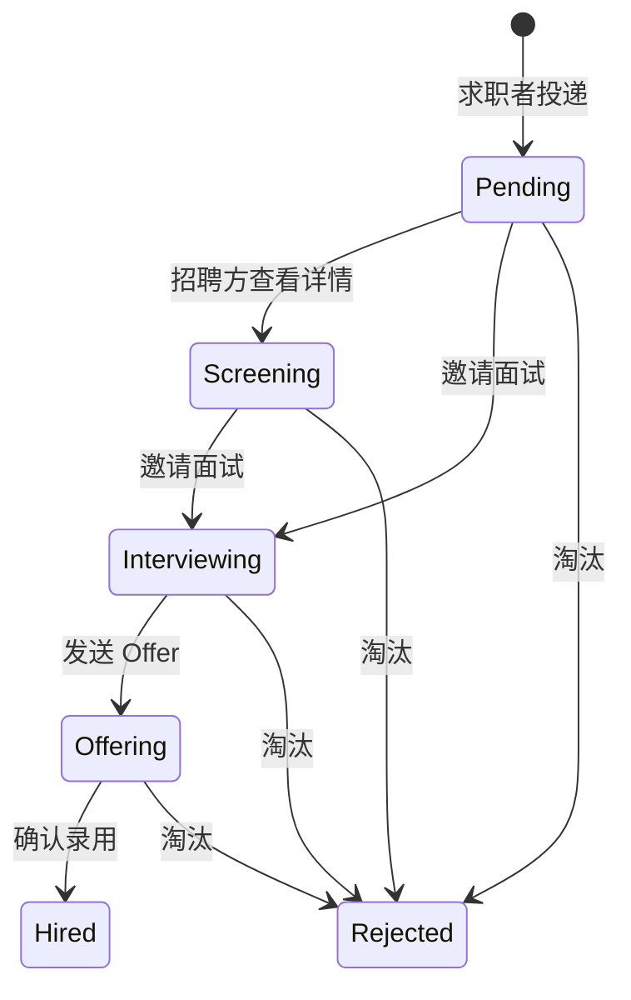

# 投递

## 说明

- 路由前缀：`/rc`
- 鉴权：均需 `Bearer Token`，并使用 `auth:rc`
- 适用对象：
  - **求职者**（`identity_type = 1`）：投递、查看自己的记录、撤回
  - **招聘方**（`identity_type = 2`，已绑定企业）：查看本企业收到的投递
- 成功响应：`api_response()`，结构为 `code` + `data` + `meta`
- 业务错误：`error()`，结构为 `code` + `message` + `meta`

> 投递是求职者与招聘方共用的业务资源，因此统一挂在 `/rc/applications`，而非 `/rc/talent/*`。

---

## 公共数据结构

### 投递对象（`RcApplicationResource`）

| 字段 | 类型 | 说明 |
|------|------|------|
| `id` | int | 投递 ID |
| `company_id` | int | 企业 ID |
| `job_id` | int | 职位 ID |
| `resume_id` | int | 简历 ID |
| `candidate_user_id` | int | 候选人用户 ID |
| `current_stage_id` | int\|null | 当前招聘阶段 |
| `source_type` | int | 来源类型，见 [RcApplicationSourceType](#rcapplicationsourcetype) |
| `source_type_label` | string\|null | 来源类型中文 |
| `status` | int | 投递状态，见 [RcApplicationStatus](#rcapplicationstatus) |
| `status_label` | string\|null | 投递状态中文 |
| `applied_at` | string\|null | 投递时间 |
| `withdrawn_at` | string\|null | 撤回时间 |
| `created_at` | string\|null | 创建时间 |
| `updated_at` | string\|null | 更新时间 |
| `job` | object\|null | 关联职位（`RcJobResource`） |
| `company` | object\|null | 企业摘要 `{ id, name }` |
| `resume` | object\|null | 求职者视角返回本人实时简历（`RcResumeResource`） |
| `candidate` | object\|null | 招聘方视角返回候选人摘要（脱敏，无联系方式） |
| `resume_snapshot` | object\|null | 招聘方详情页返回投递时完整简历快照，见 [投递简历快照](#投递简历快照) |

### 投递简历快照（`resume` / `resume_snapshot`）

求职者详情返回实时 `resume`；招聘方详情返回投递时 `resume_snapshot`。两者结构一致，均包含：

| 区块 | 说明 |
|------|------|
| 基本信息 | `RcResumeResource` 全部字段（姓名、联系方式、学历、居住城市等） |
| `works` | 工作经历列表（`RcResumeWorkResource`） |
| `educations` | 教育经历列表（`RcResumeEducationResource`） |
| `languages` | 语言能力列表（`RcResumeLanguageResource`） |
| `skills` | 专业技能列表（`RcResumeSkillResource`） |

快照在投递时写入，后续候选人修改简历不会影响已投递记录。招聘方详情中的 `phone`、`email` 仅返回脱敏值（如 `138****8000`、`can******@example.com`），不暴露真实联系方式。

### 候选人摘要（`candidate`，招聘方视角）

| 字段 | 类型 | 说明 |
|------|------|------|
| `full_name` | string\|null | 姓名 |
| `age` | int\|null | 年龄 |
| `work_years` | int\|null | 工作年限 |
| `highest_education_level` | int\|null | 最高学历 |
| `current_residence_city` | string\|null | 现居住城市全称 |
| `current_city_code` | string\|null | 现居住城市编码 |

### 视角差异

| 视角 | 列表 | 详情 |
|------|------|------|
| 求职者 | `job` + `company` + `resume` | `job` + `company` + `resume`（实时简历，不含 `resume_snapshot`） |
| 招聘方 | `job` + `company` + `candidate`（无联系方式） | `job` + `company` + `candidate` + `resume_snapshot`（联系方式脱敏） |

> `resume_snapshot` 仅在详情接口（`show`）返回，列表不返回，避免批量暴露联系方式。快照内容为投递时刻的简历完整副本，后续候选人修改简历不影响已投递记录。

---

## 1) 投递列表

- 接口：`GET /rc/applications`
- 描述：求职者查看自己的投递；招聘方查看本企业收到的投递

### Query 参数

| 字段 | 是否必填 | 说明 |
|------|----------|------|
| `job_id` | 否 | 招聘方按职位筛选 |
| `status` | 否 | 按投递状态筛选 |
| `per_page` | 否 | 每页条数，默认 15，最大 100 |

### 错误说明

| code | message |
|------|---------|
| `422` | 请先切换为求职者或招聘方身份。 |

---

## 2) 投递详情

- 接口：`GET /rc/applications/{id}`
- 描述：求职者查看自己的投递详情；招聘方查看本企业收到的投递详情
- 鉴权：需 `Bearer Token` + 当前身份为求职者或招聘方

### Path 参数

| 字段 | 是否必填 | 说明 |
|------|----------|------|
| `id` | 是 | 投递记录 ID |

### 身份与数据范围

系统根据**当前 Token 绑定的身份**决定查询范围与返回字段：

| 当前身份 | 数据范围 | 详情额外字段 |
|----------|----------|--------------|
| 求职者 | 仅 `candidate_user_id = 当前用户` 的记录 | `resume`（实时简历） |
| 招聘方（已绑定企业） | 仅 `company_id = 当前企业` 的记录 | `candidate` + `resume_snapshot` |

> 同一用户若同时拥有求职者与招聘方身份，以 Token 当前身份为准；招聘方身份优先走企业视角。

### 招聘方查看自动流转

招聘方查看投递详情时，若当前状态为 `待处理`（`Pending`），系统会自动更新为 `筛选中`（`Screening`），并写入流转记录。求职者查看自己的投递详情**不会**触发状态变更。

### 求职者成功响应示例

```json
{
  "code": 200,
  "data": {
    "id": 18,
    "company_id": 1,
    "job_id": 12,
    "resume_id": 3,
    "candidate_user_id": 42,
    "current_stage_id": 2,
    "source_type": 1,
    "source_type_label": "主动投递",
    "status": 0,
    "status_label": "待处理",
    "applied_at": "2026-06-11T10:00:00.000000Z",
    "withdrawn_at": null,
    "created_at": "2026-06-11T10:00:00.000000Z",
    "updated_at": "2026-06-11T10:00:00.000000Z",
    "job": {
      "id": 12,
      "title": "Laravel 工程师",
      "company": { "id": 1, "name": "南昌示例科技有限公司" }
    },
    "company": {
      "id": 1,
      "name": "南昌示例科技有限公司"
    },
    "resume": {
      "id": 3,
      "full_name": "求职者甲",
      "phone": "13800138000",
      "email": "seeker@example.com"
    }
  }
}
```

### 招聘方成功响应示例

```json
{
  "code": 200,
  "data": {
    "id": 18,
    "company_id": 1,
    "job_id": 12,
    "resume_id": 3,
    "candidate_user_id": 42,
    "current_stage_id": 2,
    "source_type": 1,
    "source_type_label": "主动投递",
    "status": 1,
    "status_label": "筛选中",
    "applied_at": "2026-06-11T10:00:00.000000Z",
    "withdrawn_at": null,
    "job": {
      "id": 12,
      "title": "Laravel 工程师"
    },
    "company": {
      "id": 1,
      "name": "南昌示例科技有限公司"
    },
    "candidate": {
      "full_name": "候选人甲",
      "age": 28,
      "work_years": 5,
      "highest_education_level": 4,
      "current_residence_city": "中国江西省南昌市",
      "current_city_code": "360100"
    },
    "resume_snapshot": {
      "full_name": "候选人甲",
      "phone": "138****8000",
      "email": "can******@example.com",
      "works": [
        { "company_name": "杭州示例科技有限公司", "position": "Laravel 工程师" }
      ],
      "educations": [
        { "school_name": "浙江大学", "major": "软件工程" }
      ],
      "languages": [
        { "language": "英语" }
      ],
      "skills": [
        { "skill_name": "Laravel" }
      ]
    }
  }
}
```

`resume_snapshot` 包含投递时的基本信息、工作经历、教育经历、语言能力、专业技能，详见 [投递简历快照](#投递简历快照)。

### 错误说明

| code | message | 说明 |
|------|---------|------|
| `422` | 请先切换为求职者或招聘方身份。 | 当前 Token 未绑定有效身份 |
| `404` | 投递记录不存在。 | 记录不存在，或不在当前身份可访问范围内 |

---

## 3) 投递简历

- 接口：`POST /rc/applications`
- 描述：求职者向指定在招职位投递简历
- 适用身份：求职者

### Body 参数

| 字段 | 是否必填 | 说明 |
|------|----------|------|
| `job_id` | 是 | 职位 ID |
| `resume_id` | 否 | 指定简历；不传则使用主简历 |

### 请求示例

```http
POST /rc/applications
Authorization: Bearer {token}
Content-Type: application/json

{
  "job_id": 12,
  "resume_id": 3
}
```

### 业务规则

- 职位须已发布且未过期
- 简历须属于当前用户且状态正常
- 同一职位不可重复活跃投递；已撤回后可重新投递
- 投递时写入 `resume_snapshot` 供招聘方后续查看

---

## 4) 撤回投递

- 接口：`POST /rc/applications/{id}/withdraw`
- 描述：求职者撤回自己的投递
- 适用身份：求职者

### 可撤回状态

`待处理`、`筛选中`、`面试中`、`Offer 中` 可撤回。

---

## 5) 邀请面试

- 接口：`POST /rc/applications/{id}/invite-interview`
- 描述：招聘方邀请候选人面试，创建面试记录并将投递状态更新为 `面试中`
- 适用身份：招聘方（已绑定企业）

### 可执行状态

`待处理`、`筛选中`

### Body 参数

| 字段 | 是否必填 | 说明 |
|------|----------|------|
| `interview_at` | 是 | 面试时间，须晚于当前时间 |
| `mode` | 是 | 面试方式：`1` 线上、`2` 线下、`3` 电话 |
| `interviewer_user_id` | 否 | 面试官用户 ID |
| `interviewer_name` | 否 | 面试官姓名 |
| `duration_mins` | 否 | 面试时长（分钟） |
| `location` | 否 | 面试地点（线下时建议填写） |
| `meeting_url` | 否 | 线上会议链接 |
| `note` | 否 | 备注 |

### 业务失败

| code | message |
|------|---------|
| `422` | 请先切换为招聘方身份并绑定企业。 / 当前状态不可邀请面试。 |
| `404` | 投递记录不存在。 |

---

## 6) 发送 Offer

- 接口：`POST /rc/applications/{id}/send-offer`
- 描述：招聘方向候选人发送 Offer，创建或更新 Offer 记录，状态更新为 `Offer中`
- 适用身份：招聘方（已绑定企业）

### 可执行状态

`面试中`

### Body 参数

| 字段 | 是否必填 | 说明 |
|------|----------|------|
| `salary_min` | 否 | 最低薪资 |
| `salary_max` | 否 | 最高薪资，须 ≥ `salary_min` |
| `salary_unit` | 否 | 薪资单位：`1` 月、`2` 日、`3` 时，默认 `1` |
| `entry_date` | 否 | 入职日期 |
| `expire_date` | 否 | Offer 过期日期 |
| `note` | 否 | 备注 |

### 业务失败

| code | message |
|------|---------|
| `422` | 请先切换为招聘方身份并绑定企业。 / 当前状态不可发送 Offer。 / 该投递的 Offer 已结束，无法重新发送。 |
| `404` | 投递记录不存在。 |

---

## 7) 确认录用

- 接口：`POST /rc/applications/{id}/hire`
- 描述：招聘方确认录用候选人，状态更新为 `录用`，关联 Offer 标记为已接受
- 适用身份：招聘方（已绑定企业）

### 可执行状态

`Offer中`

### Body 参数

| 字段 | 是否必填 | 说明 |
|------|----------|------|
| `note` | 否 | 备注 |

### 业务失败

| code | message |
|------|---------|
| `422` | 请先切换为招聘方身份并绑定企业。 / 当前状态不可确认录用。 |
| `404` | 投递记录不存在。 |

---

## 8) 淘汰

- 接口：`POST /rc/applications/{id}/reject`
- 描述：招聘方淘汰候选人，状态更新为 `淘汰`
- 适用身份：招聘方（已绑定企业）

### 可执行状态

`待处理`、`筛选中`、`面试中`、`Offer中`

### Body 参数

| 字段 | 是否必填 | 说明 |
|------|----------|------|
| `note` | 否 | 淘汰原因备注 |

### 业务失败

| code | message |
|------|---------|
| `422` | 请先切换为招聘方身份并绑定企业。 / 当前状态不可淘汰。 |
| `404` | 投递记录不存在。 |

---

## 投递状态流转（招聘方）



---

## 前端推荐流程

### 求职者

1. 浏览职位 `GET /rc/talent/jobs` / `GET /rc/talent/jobs/{id}`
2. 投递 `POST /rc/applications`
3. 跟踪进度 `GET /rc/applications`

### 招聘方

1. 查看某职位收到的简历 `GET /rc/applications?job_id={id}`
2. 查看候选人投递详情 `GET /rc/applications/{id}`（待处理自动变为筛选中）
3. 邀请面试 `POST /rc/applications/{id}/invite-interview`
4. 发送 Offer `POST /rc/applications/{id}/send-offer`
5. 确认录用 `POST /rc/applications/{id}/hire`，或淘汰 `POST /rc/applications/{id}/reject`

---

## 枚举

### RcApplicationStatus

| 值 | 标签 | 说明 |
|----|------|------|
| `0` | 待处理 | 初始状态 |
| `1` | 筛选中 | 招聘方筛选中 |
| `2` | 面试中 | 面试流程中 |
| `3` | Offer中 | Offer 阶段 |
| `4` | 录用 | 已录用 |
| `5` | 淘汰 | 已淘汰 |
| `6` | 撤回 | 求职者已撤回 |

### RcApplicationSourceType

| 值 | 标签 |
|----|------|
| `1` | 主动投递 |
| `2` | 内推 |
| `3` | 猎头 |
| `4` | 校招 |
| `5` | 政府渠道 |
| `6` | 导入 |

---

## 相关文档

- [职位搜索.md](./职位搜索.md)
- [人才搜索.md](./人才搜索.md)
- [简历.md](./简历.md)
