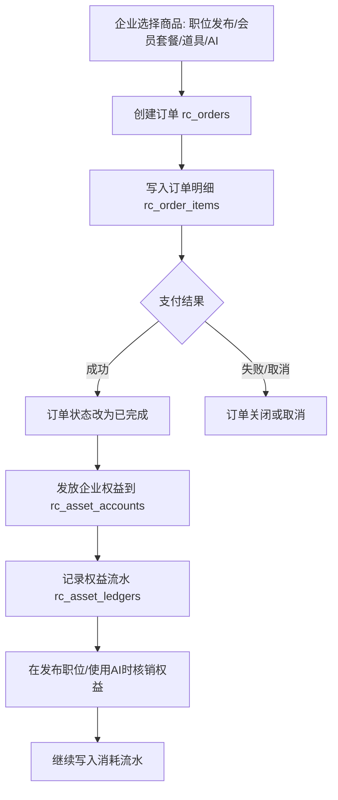
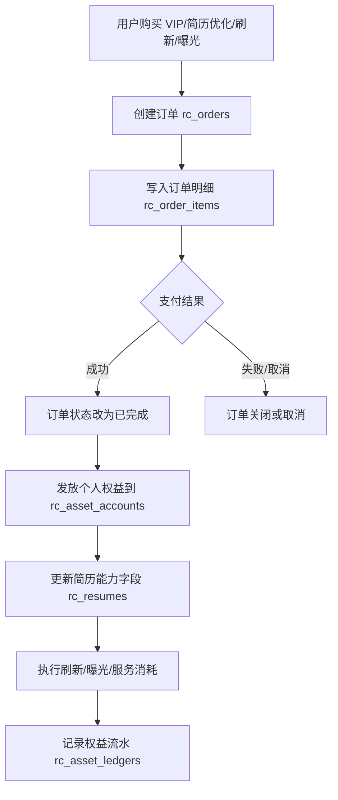

# RC 商业化流程说明（B 端 / C 端）

## 一、目标概览

- **B 端（招聘方）**：付费占比约 85%，重点围绕职位发布、会员套餐、增值道具、AI 招聘工具。
- **C 端（求职者）**：付费占比约 10%，重点围绕简历优化、VIP 辅导、刷新、曝光。

本次先完成商业化落库基础字段与表结构，后续按业务迭代接入下单、支付、权益发放和核销逻辑。

## 二、核心数据结构（本次新增）

1. `oa_biz_plans` 新增 OA 商业化扩展字段
   - `target_side`：目标端（B/C）
   - `product_type`：商品类型（套餐/道具/AI/VIP 等）
   - `billing_cycle`：计费周期（一次性/月/季/年/按量）
   - `quota_rules`：权益配额规则（JSON）
2. `rc_biz_plans`
   - RC 业务线独立套餐表，承接招聘方套餐与后续商业化商品
3. `rc_orders` / `rc_order_items`
   - 统一承载 B/C 商业化订单与明细
   - 支持场景分类、支付状态、订单状态、金额拆分
4. `rc_asset_accounts` / `rc_asset_ledgers`
   - 资产账户（余额、冻结、到期）
   - 资产流水（发放、消耗、退款、过期、调整）
5. `rc_jobs`、`rc_resumes` 增加商业化相关字段
   - 职位加速、简历 VIP/刷新/曝光配额等

## 三、B 端商业化流程图

## 四、C 端商业化流程图

## 五、落地建议

1. 先接通下单与支付回调，确保订单状态准确。
2. 再接权益发放与核销，做到“每次权益变化都有流水”。
3. 最后在 B 端职位发布与 C 端简历服务接口接入资产校验，避免超用。
